**Note:**

-An R Notebook is an R Markdown document with chunks that can be executed independently and interactively, with output visible immediately beneath the input.

-Notebook output are available as HTML, PDF, Word, or Latex. 

-This Notebook as HTML is preferably open with Google Chrome.

-R-Code can be extracted as Rmd file under the button "Code" in the notebook.

-This Notebook using iterative development. It means the process starts with a simple implementation of a small set of idea requirements and iteratively enhances the evolving versions until the complete version is implemented and perfect.


#Getting started

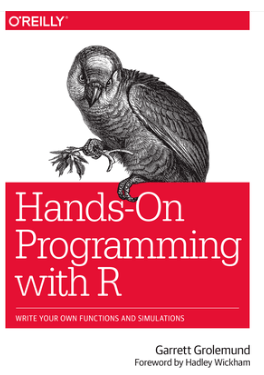

```{r}

#https://rstudio-education.github.io/hopr/

```


This book are:

* Teach you how to program in R, with hands-on examples
* A friendly introduction to the R language
* Newfound skills to solve practical data science problems
* Go from loading data to writing your own functions
* Help you become a data scientist, as well as a computer scientist
* Focus on the programming skills that are most related to data science
* Treat R purely as a programming language

<Br>

# =Project 1: Weighted Dice

Improve your ability as a data scientist:

* Memorize (store) entire data sets
* Recall data values on demand
* Perform complex calculations with large amounts of data
* Do repetitive tasks without becoming careless or bored

Your first mission is simple: assemble R code that will simulate rolling a pair of dice, like at a craps table. In this project, you will learn how to:

* Use the R and RStudio interfaces
* Run R commands
* Create R objects
* Write your own R functions and scripts
* Load and use R packages
* Generate random samples
* Create quick plots
* Get help when you need it

You'll need to have both R and RStudio installed on your computer before you can use them. Both are free and easy to download. See **Appendix A**

<Br>

#1. The Very Basics

In it, you will build a pair of virtual dice that you can use to generate random numbers.

##_The R User Interface:

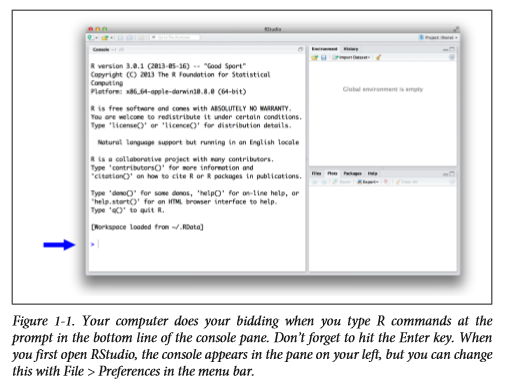

```{r}

#https://rstudio-education.github.io/hopr/basics.html#the-r-user-interface

```


>If you do not yet have R and RStudio intalled on your computer-or do not know what I am talking about-visit Appendix A. The appendix will give you an overview of the two free tools and tell you how to download them.

When you type a command at the prompt and hit Enter, your computer executes the command and shows you the results. Then RStudio displays a fresh prompt for your next command. For example, if you type 1 + 1 and hit Enter, RStudio will display:

```{r}
1 + 1 

```

You can mostly ignore the numbers that appear in brackets:

```{r}

100:130 

```


If you type an incomplete command and press Enter, R will display a + prompt, which means R is waiting for you to type the rest of your command. Either finish the command or hit Escape to start over:

```{r}
5 -


```

If you type a command that R doesn't recognize, R will return an error message. 
If you ever see an error message, don't panic. R is just telling you that your computer couldn't understand or do what you asked it to do.

```{r}

3 % 5

```

Once you get the hang of the command line, you can easily do anything in R that you would do with a calculator. For example, you could do some basic arithmetic:
  
```{r}
2 * 3

4 - 1


6 / (4 - 1)

```
  
 

____Exercise_The R User Interface:

1. Choose any number and add 2 to it.
2. Multiply the result by 3.
3. Subtract 6 from the answer.
4. Divide what you get by 3.
  
Solution:

```{r}

10 + 2
## 12

12 * 3
## 36

36 - 6
## 30

30 / 3
## 10

```

  
##_Objects:

R lets you save data by storing it inside an R object. What's an object? Just a name that you can use to call up stored data.


 
```{r}

a <- 1 
a
  
die <- 1:6
die

```

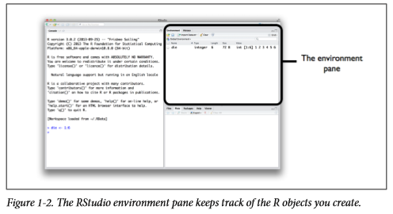

```{r}

#https://rstudio-education.github.io/hopr/basics.html#objects

```


R also understands capitalization (or is case-sensitive), so name and Name will refer to different objects: 

```{r}

Name <- 1 
Name
name <- 0
name  
```

You can see which object names you have already used with the function ls:

```{r}
ls() 

```


If you are a big fan of linear algebra (and who isn't?), you may notice that R does not always follow the rules of matrix multiplication. Instead, R uses element-wise execution. When you manipulate a set of numbers, R will apply the same operation to each element in the set. So for example, when you run die - 1, R subtracts one from each element of die. 

The result will be a new vector the same length as the first two, as shown in Figure 1-3.

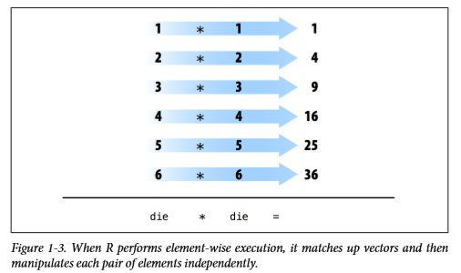

```{r}

#https://rstudio-education.github.io/hopr/basics.html#objects

```


If you give R two vectors of unequal lengths, R will repeat the shorter vector until it is as long as the longer vector, and then do the math, as shown in Figure 1-4. 

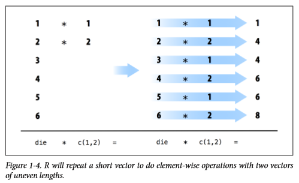

```{r}

#https://rstudio-education.github.io/hopr/basics.html#objects

```


But don't think that R has given up on traditional matrix multiplication. You just have to ask for it when you want it. You can do inner multiplication with the `%*%` operator and outer multiplication with the `%o%` operator:

```{r}

die<-1:8
die
die*die  
die%*%die
die%o%die   


```

  
  
  
##_Functions:

Using a function is pretty simple. Just write the name of the function and then the data you want the function to operate on in parentheses:

```{r}

round(3.1415) ## 3
factorial(3) ## 6 

```

The data that you pass into the function is called the function's argument. The argument can be raw data, an R object, or even the results of another R function. In this last case, R will work from the innermost function to the outermost, as in Figure 1-5:

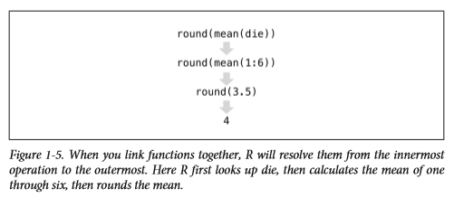

```{r}

#https://rstudio-education.github.io/hopr/basics.html#objects

```
  
If you're not sure which names to use with a function, you can look up the function's arguments with args. To do this, place the name of the function in the parentheses behind args. For example, you can see that the round function takes two arguments, one named x and one named digits:

```{r}

round(3.444)
  args(round) ## function (x, digits = 0) ## NULL 

```

##_Sample with Replacement:

Sampling with replacement is an easy way to create independent random samples. 
Each value in your sample will be a sample of size one that is independent of the other values. This is the correct way to simulate a pair of dice:

```{r}

sample(die, size = 2, replace = TRUE) 
dice <- sample(die, size = 2, replace = TRUE) 
dice 
sum(dice) 

```

  
What would happen if you call dice multiple times? Would R generate a new pair of dice values each time? Let's give it a try:
  
```{r}

dice 
dice 
dice 

```
  
Nope. Each time you call dice, R will show you the result of that one time you called sample and saved the output to dice. R won't rerun sample(die, 2, replace = TRUE) to create a new roll of the dice. This is a relief in a way. Once you save a set of results to an R object, those results do not change. Programming would be quite hard if the values of your objects changed each time you called them. 
  
  
##_Writing Your Own Functions: 

To recap, you already have working R code that simulates rolling a pair of dice:

```{r}

die <- 1:6 
dice <- sample(die, size = 2, replace = TRUE) 
sum(dice) 

```

It would be easier to use your code if you wrapped it into its own function.

Functions may seem mysterious or fancy, but they are just another type of R object. Instead of containing data, they contain code. This code is stored in a special format that makes it easy to reuse the code in new situations. You can write your own functions by recreating this format.
    
##_The Function Constructor:

Every function in R has three basic parts: a name, a body of code, and a set of arguments. 

> my_function <- function() {} 

```{r}

roll <- function() {  
      die <- 1:6  
      dice <- sample(die, size = 2, replace = TRUE)  
      sum(dice) 
      } 


    roll()
    roll

```


##_Arguments:

```{r}

 roll2 <- function(bones = 1:6) {  
      dice <- sample(bones, size = 2, replace = TRUE) 
      sum(dice) 
      } 
    
    
    roll2()
    roll2

```

Finally, you give your function a name by saving its output to an R object, as shown in Figure 1-6.  

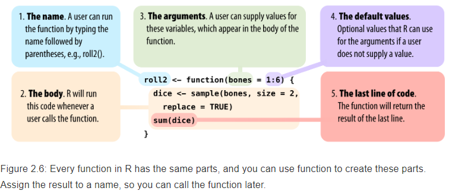

```{r}

#https://rstudio-education.github.io/hopr/basics.html#objects

```


##_Scripts:

You can open an R script in RStudio by going to File > New File > R script in the menu bar. RStudio will then open a fresh script above your console pane, as shown in Figure 1-7. Figure 1-8. 
    
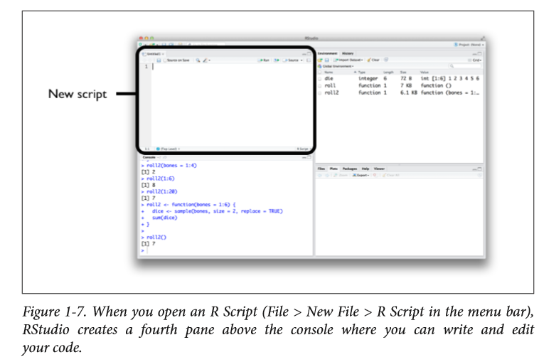

```{r}

#https://rstudio-education.github.io/hopr/basics.html#objects

```

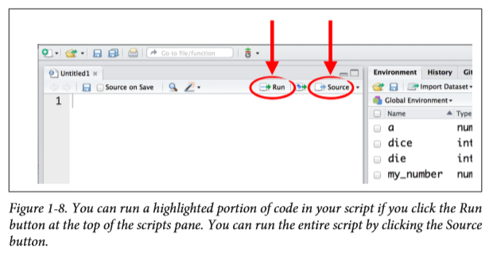

```{r}

#https://rstudio-education.github.io/hopr/basics.html#objects

```


##_Summary:

The two most important components of the R language are objects, which store data, and functions, which manipulate data. You'll also look at two of the most useful components of the R language: 

R packages, which are collections of functions writted by R's talented community of developers, and R documentation, which is a collection of help pages built into R that explains every function and data set in the language.
    


#2. Packages and Help Pages

Many of the most useful R tools come in R packages, so let's take a moment to look at what R packages are and how you can use them. 


##_Packages:

We're going to use the qplot function to make some quick plots. qplot comes in the ggplot2 package, a popular package for making graphs. Before you can use qplot, or anything else in the ggplot2 package, you need to download and install it.

##_Install.packages:

Each R package is hosted at http://cran.r-project.org, the same website that hosts R. However, you don't need to visit the website to download an R package; You can download packages straight from R's command line.

Here's how:

1. Open RStudio. 
2. Make sure you are connected to the Internet. 
3. Run `install.packages("ggplot2")` at the command line. 

##_library:


Installing a package doesn't place its functions at your fingertips just yet: It simply places them in your hard drive. To use an R package, you next have to load it in your R session with the command `library("ggplot2")`. 


The main thing to remember is that you only need to install a package once, but you need to load it with library each time you wish to use it in a new R session. R will unload all of its packages each time you close RStudio. 

The following code will make the plot that appears in Figure 2-1. 

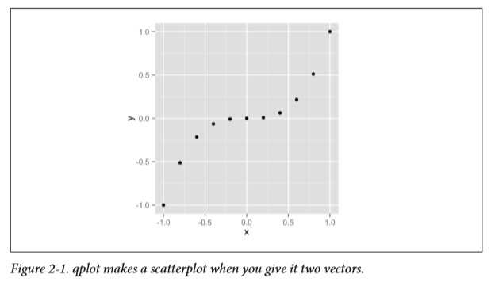

```{r}

#https://rstudio-education.github.io/hopr/basics.html#objects

```

Give c all of the numbers that you want to appear in the vector, separated by a comma. c stands for concatenate, but you can think of it as "collect" or "combine":

```{r}

x <- c(-1, -0.8, -0.6, -0.4, -0.2, 0, 0.2, 0.4, 0.6, 0.8, 1) 
x ## -1.0 -0.8 -0.6 -0.4 -0.2  0.0  0.2  0.4  0.6  0.8  1.0
y <- x^3 
y ## -1.000 -0.512 -0.216 -0.064 -0.008  0.000  0.008 ##  0.064  0.216  0.512  1.000

plot(x, y)

```


The following code makes the left-hand plot in Figure 2-2 (we'll worry about the right-hand plot in just second). To make sure our graphs look the same, use the extra argument binwidth = 1:


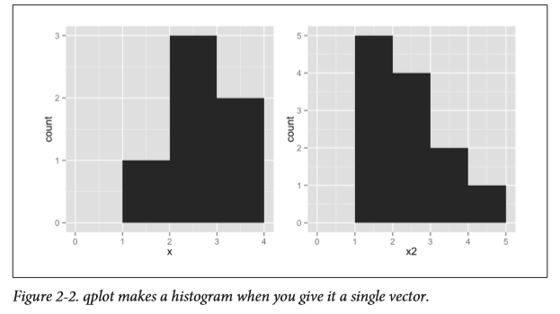

```{r}

#https://rstudio-education.github.io/hopr/basics.html#objects

```

```{r}

x <- c(1, 2, 2, 2, 3, 3) 
hist(x, binwidth = 1)


```

Let's try another histogram. This code makes the right-hand plot in Figure 2-2.

```{r}

x2 <- c(1, 1, 1, 1, 1, 2, 2, 2, 2, 3, 3, 4) 
plot(x2, binwidth = 1)


```

##_Exercise_1:

Let x3 be the following vector:

```{r}
x3 <- c(0, 1, 1, 2, 2, 2, 3, 3, 4)


```


* Imagine what a histogram of x3 would look like. 
* Assume that the histogram has a bin width of 1. 
* How many bars will the histogram have? 
* Where will they appear? 
* How high will each be? When you are done, plot a histogram of x3 with binwidth = 1, and see if you are right.

How can you use a histogram to check the accuracy of your dice? Well, if you roll your dice many times and keep track of the results, you would expect some numbers to occur more than others. This is because there are more ways to get some numbers by adding two dice together than to get other numbers, as shown in Figure 2-3. 

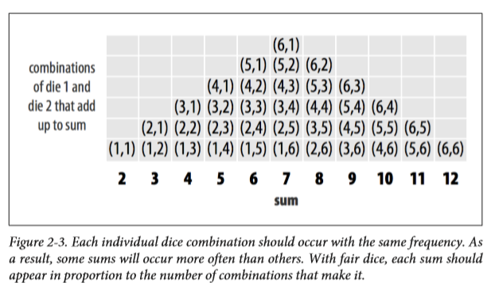

```{r}

#https://rstudio-education.github.io/hopr/basics.html#objects

```

This is where replicate comes in. Replicate provides an easy way to repeat an R command many times. 
To use it, first give replicate the number of times you wish to repeat an R command, and then give it the command you wish to repeat. Replicate will run the command multiple times and store the results as a vector:

```{r}

roll <- function() {  
      die <- 1:6  
      dice <- sample(die, size = 2, replace = TRUE)  
      sum(dice) 
      } 

replicate(3, 1 + 1) 
replicate(10, roll()) 
  

```

So let's simulate 10,000 dice rolls and plot the results. Don't worry; qplot and replicate can handle it. Figure 2-4:
  
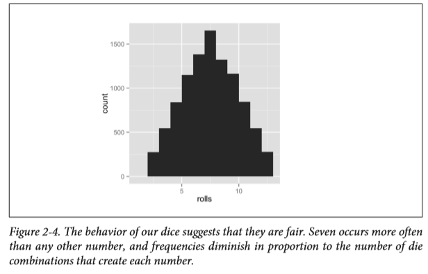

```{r}

#https://rstudio-education.github.io/hopr/basics.html#objects

```


```{r}

roll <- function() {  
    die <- 1:6  
    dice <- sample(die, size = 2, replace = TRUE)  
    sum(dice) 
  } 

  rolls <- replicate(10, roll()) 
  hist(rolls, binwidth = 1) 
rolls

```


##_Getting Help with Help Pages:

There are over 1,000 functions at the core of R, and new R functions are created all of the time. This can be a lot of material to memorize and learn! Luckily, each R function comes with its own help page, which you can access by typing the function's name after

```{r}

?sqrt
?log10 
?sample

```


Here, almost every help page includes some example code that puts the function in action. Running this code is a great way to learn by example.

!!!If a function comes in an R package, R won't be able to find its help page unless the package is loaded.


##_Parts of a Help Page:

Each help page is divided into sections. Which sections appear can vary from help page to help page, but you can usually expect to find these useful topics: 

* -Description
* -Usage
* -Arguments
* -Details
* -Value

If you'd like to look up the help page for a function but have forgotten the function's name, you can search by keyword.  

To do this, type two question marks followed by a keyword in R's command line. R will pull up a list of links to help pages related to the keyword. You can think of this as the help page for the help page:

```{r}

??log

```


##_Exercise_2:

Rewrite the roll function to roll a pair of weighted dice:

```{r}

roll <- function() {  
    die <- 1:6  
    dice <- sample(die, size = 2, replace = TRUE)  
    sum(dice) 
    } 

```

You will need to add a prob argument to the sample function inside of roll. This argument should tell 


sample to sample the numbers one through five with probability 1/8 and the number 6 with probability 3/8.


```{r}

roll <- function() {  
       die <- 1:6  
       dice <- sample(die, size = 2, replace = TRUE,    prob = c(1/8, 1/8, 1/8, 1/8, 1/8, 3/8))  
       
       sum(dice) 
       } 


roll()

```

This will cause roll to pick 1 through 5 with probability 1/8 and 6 with probability 3/8.

```{r}

rolls <- replicate(10000, roll()) 
hist(rolls, binwidth = 1)

```


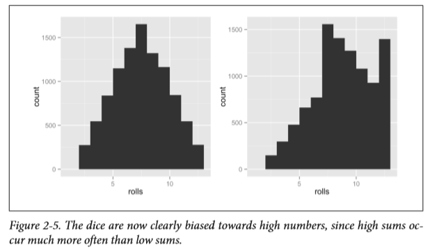

```{r}

#https://rstudio-education.github.io/hopr/basics.html#objects

```


##_Getting More Help:

* R also comes with a super active community of users that you can turn to for help on the R-help mailing list. 

* You can email the list with questions, but there's a great chance that your question has already been answered. 

* Find out by searching the archives. 

Even better than the R-help list is Stack Overflow, a website that allows programmers to answer questions and users to rank answers based on helpfulness. 


##_Summary:

* R's packages and help pages can make you a more productive programmer.

* Often the function that you want to write will already exist in an R package. 

* `install.packages`, and then load it into each new R session with `library` for using package.

* R's help pages will help you master the functions that appear in R and its packages.


# =Project 2: Playing Cards

How to store, retrieve, and change data values in your computer's memory. These skills will help you save and manage data without accumulating errors.

Along the way, you will learn how to:

* Save new types of data, like character strings and logical values
* Save a data set as a vector, matrix, array, list, or data frame
* Load and save your own data sets with R
* Extract individual values from a data set
* Change individual values within a data set
* Write logical tests
* Use R's missing-value symbol, NA

We've divided it into four tasks. Each task will teach you a new skill for managing data with R:

**Task 1: build the deck**
In R Objects, you will design and build a virtual deck of playing cards. This will be a complete data set, just like the ones you will use as a data scientist. You'll need to know how to use R's data types and data structures to make this work.

**Task 2: write functions that deal and shuffle**
Next, in R Notation, you will write two functions to use with the deck. One function will deal cards from the deck, and the other will reshuffle the deck. To write these functions, you'll need to know how to extract values from a data set with R.

**Task 3: change the point system to suit your game**
In Modifying Values, you will use R's notation system to change the point values of your cards to match the card games you may wish to play, like war, hearts, or blackjack. This will help you change values in place in existing data sets.

**Task 4: manage the state of the deck**
Finally, in Environments, you will make sure that your deck remembers which cards it has dealt. This is an advanced task, and it will introduce R's environment system and scoping rules. To do it successfully, you will need to learn the minute details of how R looks up and uses the data that you have stored in your computer.


#3. R Objects

#4. R Notation

#5. Modifying Values

#6. Environments


# =Project 3: Slot Machine

#7. Programs

#8. S3

#9. Loops

#10. Speed

#Appendix

##A. Installing R and Rstudio

You'll go from downloading R to opening your first R session. Both R and RStudio are free and easy to download (Open Source).

**How to Download and Install R: **

R is maintained by an international team of developers who make the language available through the web page of The Comprehensive R Archive Network. The top of the web page provides three links for downloading R. Follow the link that describes your operating system: Windows, Mac, or Linux. https://cran.r-project.org/

* Windows/ Mac/ Linux

To install R on Windows/Mac/Linux, click the "Download R for Windows" link. Then click the "base" link. Next, click the first link at the top of the new page. 

* 32-bit Versus 64-bit

64-bit R uses 64-bit memory pointers, and 32-bit R uses 32-bit memory pointers. This means 64-bit R has a larger memory space to use (and search through). The terms 32-bit and 64-bit refer to the way a computer's processor (also called a CPU), handles information. The 64-bit version of Windows handles large amounts of random access memory (RAM) more effectively than a 32-bit system. Source: https://support.microsoft.com/en-us/help/15056/windows-7-32-64-bit-faq


**Using R: **

R isn't a program that you can open and start using, like Microsoft Word or Internet Explorer. Instead, R is a computer language, like C, C++, or UNIX. Now almost everyone uses R with an application called RStudio IDE (Integrated Development). Windows and Mac users usually do not program from a terminal window, so the Windows and Mac downloads for R come with a simple program that opens a terminal-like window for you to run R code in. You may hear people refer to them as the Windows or Mac R GUIs (Grafics User Interfaces.

When you open RStudio, a window appears with three panes in it, as in `Figure A-1`.vThe largest pane is a console window. This is where you'll run your R code and see results. The console window is exactly what you'd see if you ran R from a UNIX console or the Windows or Mac GUIs.

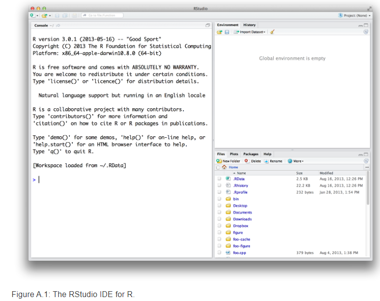


**RStudio: **

RStudio is an application like Microsoft Word-except that instead of helping you write in English, RStudio helps you write in R. 

**Getting started R Programming: **

Now that you have both R and RStudio on your computer, you can begin using R by opening the RStudio program. Open RStudio just as you would any program, by clicking on its icon or by typing "RStudio" at the Windows Run prompt.


##B. R Packages

##C. Updating R and Its Packages

##D. Loading and Saving Data in R

##E. Debugging R Code

#Change log update

* 19.01.2019
* 13.04.2019


<Br>

#Preferences

* [Hands-On Programming with R](https://rstudio-education.github.io/hopr/)


#License

[MIT](https://opensource.org/licenses/MIT)
